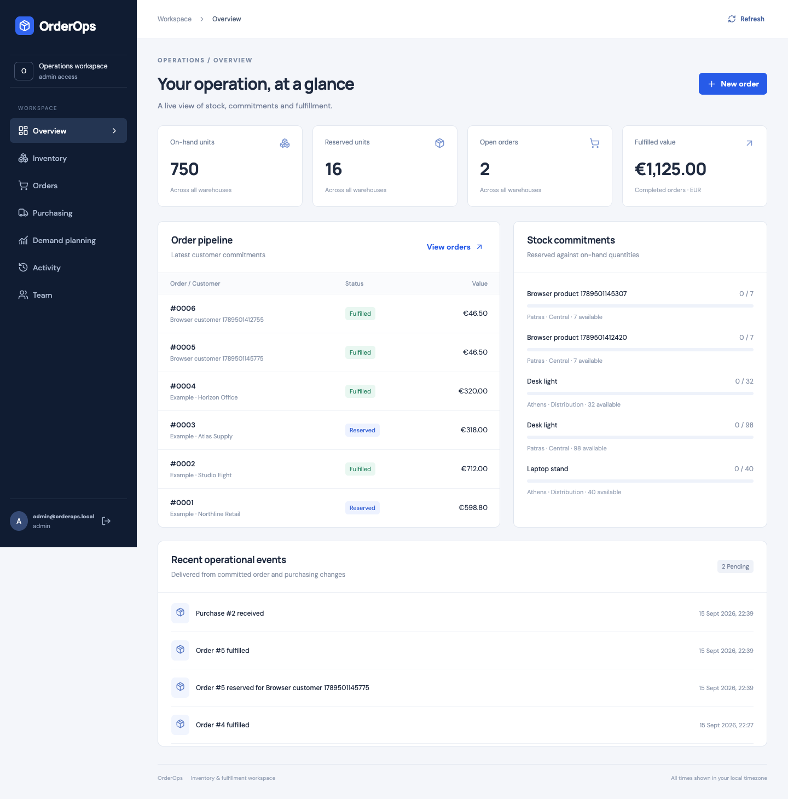
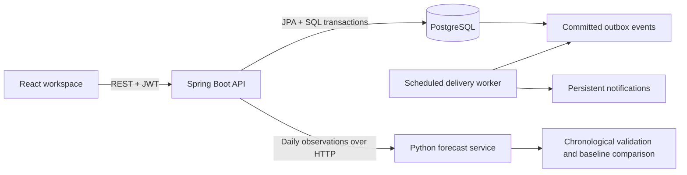

# OrderOps

**A working inventory, order fulfillment and demand planning application.**
Java 21 · Spring Boot · PostgreSQL · React · Python

[](https://github.com/GKARAMOU/orderops/actions/workflows/ci.yml)

OrderOps connects a React workspace to a transactional Spring Boot API and a real
PostgreSQL database. Operators create products and warehouses, receive stock,
reserve customer orders and complete or cancel them. A separate Python service
evaluates daily demand forecasts against a seasonal baseline.

This repository runs the complete application locally. It is not a static browser
simulation and does not use localStorage as a database. Optional sample inputs are
clearly labeled; all changes go through the same API and database.



## Run the complete application

Requirements: Docker with Compose, plus Python 3 to generate local credentials.

```bash
git clone https://github.com/GKARAMOU/orderops.git
cd orderops
python3 scripts/configure.py
docker compose up --build
```

Open **http://localhost:8080**. Use `ADMIN_EMAIL` and `ADMIN_PASSWORD` from your local
`.env`. Credentials are randomly generated and are never included in the repository.
The bootstrap account is created only if its email does not exist; changing its environment
password later does not silently replace the stored password.

The database persists in the `orderops-db` Docker volume across application restarts.
The app binds to loopback by default. No cloud account or paid service is required.

To add optional walkthrough records after the app is healthy:

```bash
python3 scripts/seed_demo.py
```

The script refuses to seed a workspace that already contains products. Its stock,
customers and demand history are explicitly synthetic; see [data sources](docs/DATA_SOURCES.md).

## Working capabilities

| Area | Behavior |
| --- | --- |
| Identity | BCrypt passwords, one-hour JWTs, ADMIN / OPERATOR / VIEWER authorization |
| Inventory | Multiple warehouses, product catalog, stock adjustment reasons, protected reservations |
| Orders | Multiple lines, available-stock reservation, fulfillment and cancellation |
| Duplicate requests | Actor-scoped idempotency keys; payload mismatch rejected |
| Purchasing | Supplier purchase creation, receipt and cancellation; receipt updates stock once |
| Audit | Actor, timestamp and details recorded in the same transaction as each operational mutation |
| Events | Transactional outbox, scheduled notification delivery, duplicate-safe consumer |
| Demand planning | CSV import, source attribution, chronological validation, baseline selection, seven-day forecast |
| Interface | Live totals, searchable records, order details, role-aware controls, responsive layouts |

### Why the stock logic matters

- Two buyers cannot reserve the same last unit. Inventory rows are locked inside the transaction.
- A multi-product order either reserves every line or rolls back completely.
- Retrying an order with the same key returns the original order without reserving again.
- Repeating fulfillment, cancellation or receipt does not apply the stock change twice.
- Adjustments cannot reduce on-hand stock below already-reserved units.
- Multi-line inventory locks are acquired in product ID order to avoid lock-order deadlocks.

See [architecture and decisions](docs/ARCHITECTURE.md) for transaction boundaries and tradeoffs.

## Architecture



The UI is served by Spring Boot in the Docker build, so API requests stay on the same
origin. The forecasting service and database are internal Compose services.

## Verification

```bash
# Backend: real PostgreSQL through Testcontainers; requires Docker
mvn -f backend/pom.xml verify

# Forecast service: Python 3.12
python3.12 -m venv forecast/.venv
forecast/.venv/bin/pip install -r forecast/requirements.txt
cd forecast
.venv/bin/python -m pytest tests -q
cd ..

# Browser tests: application running, with optional walkthrough records seeded
cd frontend
npm ci
npx playwright install chromium
BASE_URL=http://127.0.0.1:8080 npm run test:e2e
```

The backend suite can also use an isolated existing PostgreSQL database with
`TEST_DATABASE_URL`, `TEST_DATABASE_USER` and `TEST_DATABASE_PASSWORD`.
**Use a dedicated test database: integration tests clear application tables.**

The GitHub Actions workflow runs backend tests with Testcontainers, forecast tests,
container builds and browser workflows against the complete Compose application.
See [verification record](docs/VERIFICATION.md) for measured results and environment.

## Forecast evaluation

The feature uses 14 past days to form lag and weekday features, holds out the last
14 days chronologically, and compares a Random Forest with a repeating last-week baseline.
Recursive validation never reads holdout observations as prediction inputs. The selected
method is refitted or refreshed using all observations before producing seven future days.
The holdout also selects the method, so reported scores are **validation results**, not
an independent test estimate or a guarantee of business benefit.

The attributed UCI example contains 374 daily observations for one product. Reproduce it with:

```bash
# Forecast service must be running on localhost:8000
python3 scripts/evaluate_uci.py
```

The checked-in result is in [forecast-evaluation.json](docs/forecast-evaluation.json).
To regenerate the derived series from the original workbook, install `openpyxl` and run
`scripts/prepare_uci_data.py`. [Data provenance and license](docs/DATA_SOURCES.md) explain
filtering, zero-filled days, old dates and the limits of recorded sales as a demand proxy.

In the UI, create a product and warehouse for the historical experiment, import
`docs/uci-22423-daily.csv`, and name the source “UCI Online Retail, stock 22423, CC BY 4.0”.
Historical forecasts are explicitly marked as out of date. Fewer than 56 consecutive
observations produce an insufficient-data message rather than a fabricated forecast.

## API documentation

With the application running: http://localhost:8080/swagger-ui/index.html

Authenticate with `POST /api/auth/login`, then paste the returned token in Swagger's
Authorize field. Operational POST requests require ADMIN or OPERATOR; user creation
requires ADMIN. `POST /api/orders` also requires an `Idempotency-Key` header.

## Development without Docker

Use Java 21, Maven 3.9+, Node 22, Python 3.12 and PostgreSQL 17.
Create a PostgreSQL database/user, generate `.env`, and adjust `DATABASE_URL` to match.

```bash
mvn -f backend/pom.xml package -DskipTests
python3 scripts/with_env.py java -jar backend/target/orderops-0.1.0.jar
# Second terminal, after installing forecast/requirements.txt into its venv:
cd forecast && .venv/bin/uvicorn app:app --host 127.0.0.1 --port 8000
# Third terminal:
cd frontend && npm ci && npm run dev
```

Open http://localhost:5173. Vite proxies API requests to the running Java application.

## Scope and current limits

This is a single-workspace portfolio application, not a hosted production service.
Fulfillment and supplier receipt are operator-confirmed events; there are no carrier,
payment, email or supplier-system integrations. Money is represented in EUR only.
Purchase orders contain one product per record. The list UI shows the latest 500 orders
and purchases and 200 audit entries; server-side paging is a future extension.

Notifications are internal database records, with delivery retried on the next scheduled
poll after a transaction failure. There is no external message broker or dead-letter queue.
The model runs on request with bounded input. There is no background training platform.

Before internet-facing use, add managed TLS, rate limiting, password reset and token
revocation, backups/restore verification, resource limits and deployment monitoring.
Tokens are kept only in browser memory; refreshing the page requires signing in again.

## Repository map

- `backend/` — API, security, transactions, migrations and integration tests
- `frontend/` — React workspace and browser workflow tests
- `forecast/` — Python forecasting API and evaluation tests
- `scripts/` — local configuration, walkthrough data and reproducible dataset preparation
- `docs/` — architecture, validation evidence and data attribution

## License

Application code: [MIT](LICENSE). The derived UCI data remains [CC BY 4.0](docs/DATA_SOURCES.md).
